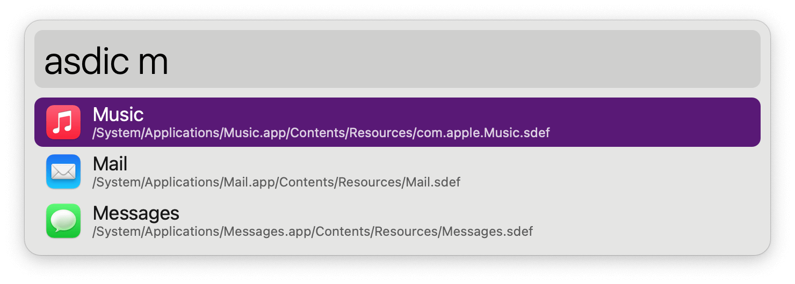
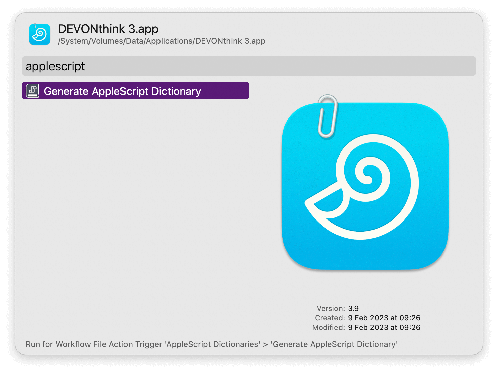

#  AppleScript Dictionaries Alfred Workflow

Find and open Mac automation dictionaries

<a href='https://alfred.app/workflows/alfredapp/applescript-dictionaries'>⤓ Install on the Alfred Gallery</a>

## Usage

Search through installed AppleScript dictionaries via the Search Keyword (default: `asdic`). <kbd>↩&#xFE0E;</kbd> to open.

The first run will take a few seconds to find the dictionaries, but subsequent runs will be instant. Updating the dictionaries list is done automatically but can be forced with <kbd>fn</kbd><kbd>↩&#xFE0E;</kbd>.

A minority of apps use an older dictionary format which can be converted with the [Universal Action](https://www.alfredapp.com/help/features/universal-actions/).

